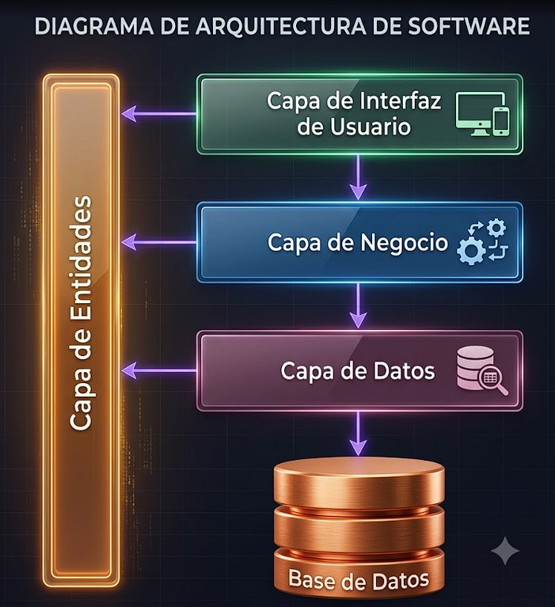
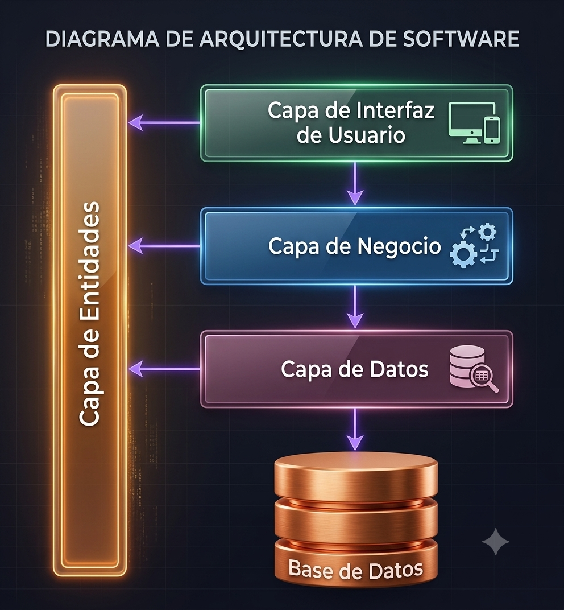
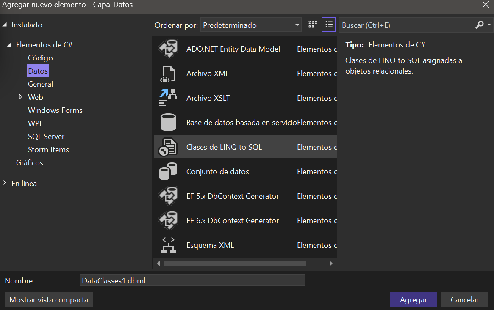
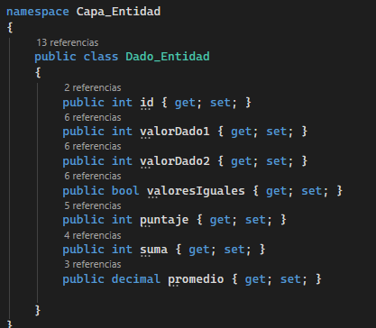
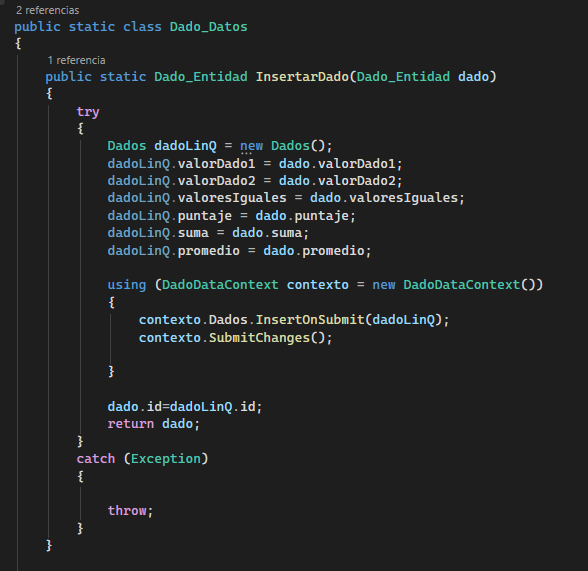
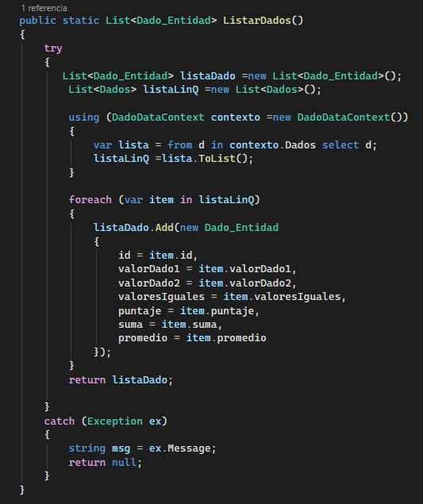
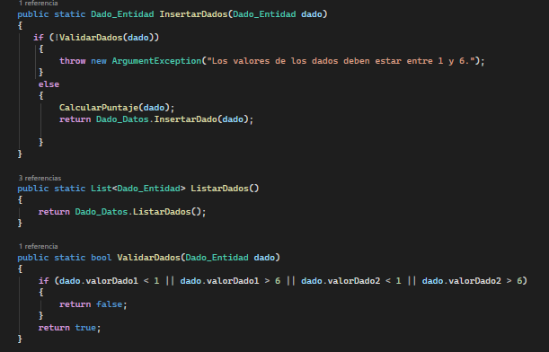
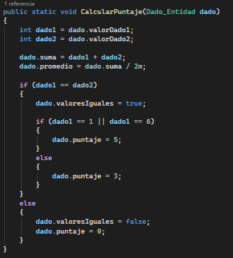
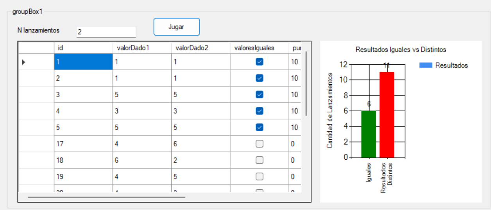

# Arquitectura 4 Capas
<p align="center">
  
</p>

## 1. Capa de Presentación
***¿Qué es?***

Es la capa que representa la parte visible del sistema. Es el medio por el cual el usuario interactúa con la aplicación mediante formularios, ventanas o páginas web.

Se utiliza para recibir la información que ingresa el usuario y mostrarle los resultados que genera el sistema. Su objetivo es facilitar la comunicación entre el usuario y la aplicación.

## Funciones
* Mostrar formularios y controles.
* Capturar los datos ingresados por el usuario.
* Mostrar mensajes y resultados.
* Enviar solicitudes a la capa de negocio.
* Recibir respuestas de la capa de negocio.

## 2. Capa de Negocio
***¿Qué es?***

Es la capa que contiene la lógica del sistema y las reglas que determinan cómo debe funcionar la aplicación. Se considera el cerebro del programa.

Se utiliza para procesar la información recibida desde la interfaz, validar datos y tomar decisiones antes de enviarlos a la base de datos o devolver resultados al usuario.

## Funciones
* Aplicar reglas del negocio.
* Validar información.
* Realizar cálculos y procesos.
* Filtrar, ordenar o agrupar datos.
* Coordinar la comunicación con la capa de datos.
* Garantizar que se cumplan las políticas del sistema.


## 3. Capa de Datos
***¿Qué es?***

Es la capa encargada de la comunicación directa con la base de datos. Gestiona todas las operaciones relacionadas con el almacenamiento y recuperación de información.

Se utiliza para ejecutar consultas y modificaciones en la base de datos sin que las demás capas conozcan cómo se realizan internamente.

## Funciones
* Conectarse a la base de datos.
* Ejecutar consultas.
* Insertar registros.
* Actualizar información.
* Eliminar datos.
* Recuperar información.
* Administrar conexiones y transacciones.

## 4. Capa de Entidades
***¿Qué es?***

Es la capa que contiene las clases que representan los objetos del sistema. Estas clases almacenan únicamente datos y sirven para transportar información entre las demás capas.

Se utiliza para definir la estructura de los datos que manejará la aplicación y facilitar el intercambio de información entre las capas.

## Funciones
* Representar entidades del sistema.
* Definir propiedades y atributos.
* Transportar datos entre capas.
* Mantener una estructura organizada de la información.

## Funcionamiento general

Cuando el usuario realiza una acción, la capa de presentación envía la solicitud a la capa de negocio. Esta procesa y valida la información, luego solicita a la capa de datos que acceda a la base de datos utilizando las entidades para transportar la información. Finalmente, la respuesta vuelve a la interfaz para mostrarse al usuario.

## Ejemplo práctico: Uso de LINQ en una Arquitectura de 4 Capas

Para demostrar el funcionamiento de LINQ dentro de una arquitectura de 4 capas, se desarrolló una aplicación en Visual Studio que simula lanzamientos de dos dados. El sistema genera resultados aleatorios, calcula puntajes y almacena la información en una base de datos SQL Server utilizando ADO.NET.

Para desarrollar una aplicación utilizando el modelo de 4 capas en Visual Studio, primero se deben crear los proyectos que representarán cada capa: Capa de Entidades, Capa de Datos, Capa de Lógica de Negocio y Capa de Presentación. Esta separación permite distribuir las responsabilidades del sistema, logrando un código más ordenado, fácil de mantener y escalable.

Para implementar la arquitectura de 4 capas en Visual Studio, se deben crear los siguientes proyectos:

* **Capa de Entidades:** Biblioteca de clases (Class Library).
* **Capa de Datos:** Biblioteca de clases (Class Library).
* **Capa de Lógica de Negocio:** Biblioteca de clases (Class Library).
* **Capa de Presentación:** Aplicación Windows Forms.

Después de crear los proyectos, es necesario agregar las referencias entre las capas para que puedan comunicarse entre sí. La **Capa de Entidades** debe ser referenciada por la **Capa de Datos**, la **Capa de Lógica de Negocio** y la **Capa de Presentación**, ya que contiene las clases que transportan la información del sistema.

* **Capa de Datos** → referencia a **Capa de Entidades**.
* **Capa de Lógica de Negocio** → referencia a **Capa de Entidades** y **Capa de Datos**.
* **Capa de Presentación** → referencia a **Capa de Entidades** y **Capa de Lógica de Negocio**.

<p align="center">
  
</p>
## Conexión a la Base de Datos mediante LINQ to SQL

Para establecer la conexión con la base de datos, es necesario contar previamente con una base de datos creada en SQL Server 2022 y con las tablas que almacenarán la información del sistema. Estas tablas permitirán realizar operaciones como insertar, consultar, modificar y eliminar registros.

Sin embargo, para evitar escribir manualmente las consultas SQL en C#, se puede utilizar **LINQ to SQL**, una tecnología que genera una clase de conexión denominada `DataContext`. Esta clase permite interactuar directamente con las tablas de la base de datos como si fueran objetos del programa, facilitando la realización de operaciones CRUD (Crear, Leer, Actualizar y Eliminar) mediante código C#, sin necesidad de escribir instrucciones SQL de forma explícita.

<p align="center">
  
</p>

## Aplicación del modelo de 4 capas

**Capa de Entidades**

Se definió la clase `Dado_Entidad`, encargada de representar la información de cada lanzamiento:

* Identificador del lanzamiento.
* Valor del primer dado.
* Valor del segundo dado.
* Indicación de si ambos valores son iguales.
* Puntaje obtenido.
* Suma de los valores.
* Promedio del lanzamiento.

Esta entidad actúa como el medio de comunicación entre todas las capas.

<p align="center">
  
</p>

**Capa de Datos**

La capa de datos utiliza ADO.NET para insertar y recuperar información desde SQL Server mediante los métodos `InsertarDado()` y `ListarDados()`.

Aunque el acceso a la base de datos se realiza mediante consultas SQL tradicionales, los datos recuperados son transformados en una lista de objetos `Dado_Entidad`, permitiendo posteriormente aplicar consultas LINQ.

<p align="center">
  
</p>

<p align="center">
  
</p>

**Capa de Negocio**

La capa de negocio aplica las reglas del sistema antes de almacenar la información. En este proyecto, valida que los valores de los dados estén entre 1 y 6, calcula la suma y el promedio, y determina el puntaje correspondiente a cada lanzamiento.

Por ejemplo, antes de registrar un lanzamiento se verifica que los valores sean válidos:

<p align="center">
  
</p>

Posteriormente, se calcula la suma y el promedio de los dados:

```csharp
dado.suma = dado1 + dado2;
dado.promedio = dado.suma / 2m;
```

Finalmente, se asigna el puntaje. Si ambos dados tienen el mismo valor, se establece `valoresIguales` como verdadero; cuando el valor repetido es 1 o 6 se asignan 5 puntos, mientras que para cualquier otro valor igual se asignan 3 puntos. Si los valores son diferentes, el puntaje es 0.

<p align="center">
  
</p>

Una vez procesada la información, esta es enviada a la capa de datos para su almacenamiento mediante el método `InsertarDado()`.


**Capa de Presentación**

La capa de presentación es la encargada de la interacción entre el usuario y el sistema. En este proyecto, permite ingresar el número de lanzamientos de los dados, generar los resultados, mostrar la información almacenada en un `DataGridView` y representar gráficamente las estadísticas obtenidas mediante un `Chart`.

Por ejemplo, el usuario ingresa la cantidad de lanzamientos y, al presionar el botón correspondiente, el sistema genera valores aleatorios para los dados y actualiza automáticamente la tabla y el gráfico con los resultados obtenidos.

```csharp
int n = Convert.ToInt32(textBox_Lanzamientos.Text);

for (int i = 0; i < n; i++)
{
    Dado_Entidad dados = new Dado_Entidad();
    dados.valorDado1 = dado1.Next(1, 7);
    dados.valorDado2 = dado1.Next(1, 7);

    Capa_LogicaNegocio.Dado_Logica.InsertarDados(dados);
}

ActualizarDatos();
```

De esta manera, la capa de presentación se encarga de recibir las acciones del usuario y mostrar los resultados procesados por las demás capas.

<p align="center">
  
</p>

### Conclusión del ejemplo

Este caso práctico demuestra que LINQ puede integrarse fácilmente dentro de una arquitectura de 4 capas. Aunque la persistencia de datos se realiza mediante ADO.NET, LINQ permite consultar, filtrar y analizar la información recuperada utilizando una sintaxis sencilla y legible. De esta manera, se mantiene la separación de responsabilidades entre capas y se obtiene un código más organizado, reutilizable y fácil de mantener.


