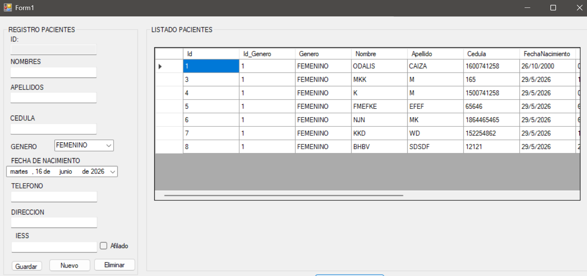
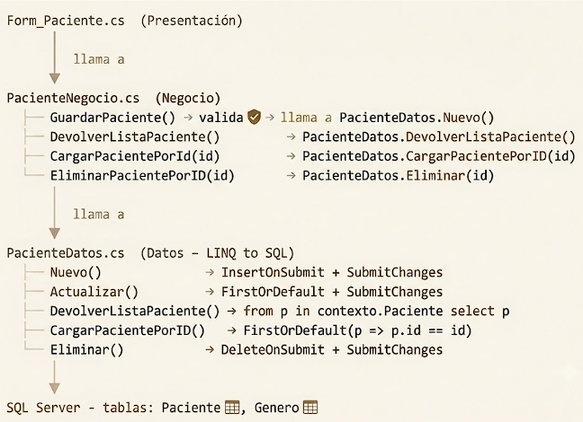

# 6. Casos prácticos

En esta sección se presentan escenarios reales resueltos con LINQ to SQL, tomados del Sistema de Gestión de Pacientes desarrollado durante las prácticas de clase. Cada caso muestra cómo se aplican los conceptos estudiados siguiendo el flujo de trabajo de la arquitectura de cuatro capas del sistema.

La estructura utilizada en cada ejemplo es la siguiente:

Problema → Implementación por capas → Resultado esperado

Proyecto utilizado: GestionUsuarios — Sistema de registro y administración de pacientes, con gestión de géneros, afiliación al IESS y operaciones CRUD completas.
---

## Estructura del proyecto

```
GestionUsuarios/
├── GestionUsuarios_Entidades/     → PacienteEntidades.cs, GeneroEntidades.cs
├── GestionUsuariosLinQ/           → PacienteDatos.cs, GeneroDatos.cs
├── GestionUsuarios_LogicaNegocio/ → PacienteNegocio.cs, GeneroNegocio.cs
└── Presentacion/                  → Form_Paciente.cs
```

**Contexto LINQ to SQL utilizado:** `ModePacienteDataContext`  
**Tablas:** `Paciente`, `Genero`

---

# Caso 1: Listar todos los pacientes con su género

## Problema

El sistema debe recuperar todos los pacientes almacenados en la base de datos y mostrarlos en la interfaz junto con el nombre del género correspondiente.

---

## Paso 1: Capa de Datos

La Capa de Datos obtiene todos los registros de la tabla `Paciente` utilizando LINQ to SQL. Posteriormente, los datos recuperados son convertidos a entidades del sistema para que puedan ser utilizados por las demás capas de la aplicación.

```csharp
public static List<PacienteEntidades> DevolverListaPaciente()
{
    List<PacienteEntidades> listaPaciente = new List<PacienteEntidades>();
    List<Paciente> listaPacienteLinQ = new List<Paciente>();

    using (ModePacienteDataContext contexto = new ModePacienteDataContext())
    {
        listaPacienteLinQ = contexto.Paciente.ToList();
    }

    foreach (var item in listaPacienteLinQ)
    {
        listaPaciente.Add(new PacienteEntidades(
            item.id,
            (int)item.id_Genero,
            item.nombre,
            GeneroDatos.DevolverNombreGeneroPorId((int)item.id_Genero),
            item.apellido,
            item.cedula,
            Convert.ToDateTime(item.fechaNacimiento),
            item.direccion,
            item.telefono,
            (bool)item.afiliado,
            item.codigoIess
        ));
    }

    return listaPaciente;
}
```

### Aspectos importantes

* `ToList()` ejecuta la consulta y obtiene todos los registros de la tabla `Paciente`.
* Se utilizan dos listas porque pertenecen a capas diferentes del sistema.
* `listaPacienteLinQ` almacena los objetos obtenidos directamente desde la base de datos.
* `listaPaciente` almacena las entidades que serán devueltas a las demás capas de la aplicación.
* El `foreach` permite transformar cada objeto `Paciente` en un objeto `PacienteEntidades`.
* El nombre del género se obtiene mediante el método `GeneroDatos.DevolverNombreGeneroPorId()`, ya que en la tabla `Paciente` únicamente se almacena el identificador del género.

**Importante:** El `foreach` actúa como un puente entre la entidad generada por LINQ to SQL y la entidad utilizada por la arquitectura del sistema, manteniendo separadas las responsabilidades de cada capa.

---

## Paso 2: Capa de Negocio

La Capa de Negocio expone el método para que pueda ser utilizado por la interfaz de usuario.

```csharp
public static List<PacienteEntidades> DevolverListaPaciente()
{
    return PacienteDatos.DevolverListaPaciente();
}
```

---

## Paso 3: Capa de Presentación

Finalmente, la Capa de Presentación obtiene la información desde la Capa de Negocio y la muestra en el `DataGridView`.

```csharp
private void CargarListaPacientes()
{
    dataGridView1.DataSource = PacienteNegocio.DevolverListaPaciente();
}
```

---

## Resultado esperado

| Id | Género    | Nombre | Apellido | Cédula     | Afiliado |
| -- | --------- | ------ | -------- | ---------- | -------- |
| 1  | Masculino | Carlos | Mora     | 1801234567 | Sí       |
| 2  | Femenino  | Ana    | García   | 1809876543 | No       |
| 3  | Femenino  | Diana  | Salazar  | 1805551234 | Sí       |

---

## Conclusión

Este caso evidencia cómo LINQ  permite obtener información de la base de datos de forma organizada, favoreciendo una mejor estructura del sistema.


# Caso 2: Buscar un paciente por ID utilizando `FirstOrDefault()`

## Problema

Cuando el usuario selecciona un paciente desde el `DataGridView`, el sistema debe recuperar todos sus datos para mostrarlos en los campos del formulario y permitir su actualización.

---

## Paso 1: Capa de Datos

La Capa de Datos utiliza `FirstOrDefault()` para localizar el primer paciente que coincida con el valor recibido como parámetro. Posteriormente, los datos obtenidos desde LINQ  son convertidos a una entidad del sistema.

```csharp
public static PacienteEntidades CargarPacientePorId(int id)
{
    PacienteEntidades paciente = new PacienteEntidades();

    using (ModePacienteDataContext contexto = new ModePacienteDataContext())
    {
        Paciente pacienteLinQ = contexto.Paciente
                                        .FirstOrDefault(p => p.id == id);

        paciente.Id = pacienteLinQ.id;
        paciente.Id_Genero = (int)pacienteLinQ.id_Genero;
        paciente.Nombre = pacienteLinQ.nombre;
        paciente.Apellido = pacienteLinQ.apellido;
        paciente.Cedula = pacienteLinQ.cedula;
        paciente.FechaNacimiento = Convert.ToDateTime(pacienteLinQ.fechaNacimiento);
        paciente.Telefono = pacienteLinQ.telefono;
        paciente.Direccion = pacienteLinQ.direccion;
        paciente.Afiliado = (bool)pacienteLinQ.afiliado;
        paciente.CodigoIESS = pacienteLinQ.codigoIess;

        return paciente;
    }
}
```

### Aspectos importantes

* `FirstOrDefault()` busca el primer registro que cumpla la condición especificada.
* En este caso, la condición es que el `id` del paciente sea igual al valor recibido por el método.
* `pacienteLinQ` representa el objeto obtenido directamente desde la base de datos.
* `paciente` corresponde a la entidad utilizada por la arquitectura del sistema.
* Los datos son transferidos desde `pacienteLinQ` hacia `PacienteEntidades` para mantener la separación entre capas.

**Importante:** Si no existe un paciente con el identificador solicitado, `FirstOrDefault()` devolverá `null`. Es recomendable verificar el resultado antes de acceder a sus propiedades.

---

## Paso 2: Capa de Negocio

La Capa de Negocio expone el método para que pueda ser utilizado desde la interfaz de usuario.

```csharp
public static PacienteEntidades CargarPacientePorId(int id)
{
    return PacienteDatos.CargarPacientePorID(id);
}
```

---

## Paso 3: Capa de Presentación

Una vez obtenido el paciente, la información puede asignarse a los controles del formulario.

```csharp
PacienteEntidades paciente = PacienteNegocio.CargarPacientePorId(idSeleccionado);

txtNombre.Text = paciente.Nombre;
txtApellido.Text = paciente.Apellido;
txtCedula.Text = paciente.Cedula;
txtTelefono.Text = paciente.Telefono;
txtDireccion.Text = paciente.Direccion;
```

---

## Resultado esperado

Si el usuario selecciona el paciente con identificador `1`, el sistema recuperará toda su información y la mostrará automáticamente en los controles del formulario para que pueda ser visualizada o modificada.

---

## Conclusión

`FirstOrDefault()` facilita la búsqueda de un registro específico, permitiendo consultar o actualizar su información de forma rápida y eficiente.


# Caso 3: Registrar un nuevo paciente utilizando `InsertOnSubmit()` y `SubmitChanges()`

## Problema

El sistema debe registrar un nuevo paciente con toda la información proporcionada por el usuario, incluyendo sus datos personales, género y afiliación al IESS.

---

## Paso 1: Capa de Datos

La Capa de Datos recibe un objeto `PacienteEntidades`, crea una entidad `Paciente` generada por LINQ , copia la información correspondiente y posteriormente realiza la inserción en la base de datos.

```csharp
public static PacienteEntidades InsertarPaciente(PacienteEntidades paciente)
{
    Paciente pacienteLinQ = new Paciente();

    pacienteLinQ.id_Genero = paciente.Id_Genero;
    pacienteLinQ.nombre = paciente.Nombre;
    pacienteLinQ.apellido = paciente.Apellido;
    pacienteLinQ.cedula = paciente.Cedula;
    pacienteLinQ.fechaNacimiento = paciente.FechaNacimiento;
    pacienteLinQ.telefono = paciente.Telefono;
    pacienteLinQ.direccion = paciente.Direccion;
    pacienteLinQ.afiliado = paciente.Afiliado;
    pacienteLinQ.codigoIess = paciente.CodigoIESS;

    using (ModePacienteDataContext contexto = new ModePacienteDataContext())
    {
        contexto.Paciente.InsertOnSubmit(pacienteLinQ);
        contexto.SubmitChanges();
    }

    paciente.Id = pacienteLinQ.id;

    return paciente;
}
```

### Aspectos importantes

* `paciente` es un objeto de tipo `PacienteEntidades`, perteneciente a la Capa de Entidades.
* `pacienteLinQ` representa la entidad `Paciente` generada por LINQ  y asociada a la tabla real de la base de datos.
* Los datos ingresados son transferidos desde `PacienteEntidades` hacia `Paciente`.
* `InsertOnSubmit()` registra el nuevo objeto para su inserción.
* `SubmitChanges()` ejecuta la operación y guarda el registro en SQL Server.
* El identificador generado automáticamente por la base de datos es recuperado y asignado nuevamente a la entidad.
* Finalmente, se devuelve el objeto con toda su información actualizada.

**Importante:** Si se utiliza `InsertOnSubmit()` sin ejecutar `SubmitChanges()`, el registro no será almacenado en la base de datos.

---

## Paso 2: Capa de Negocio

La Capa de Negocio actúa como intermediaria entre la interfaz y la Capa de Datos.

```csharp
public static PacienteEntidades InsertarPaciente(PacienteEntidades paciente)
{
    return PacienteDatos.InsertarPaciente(paciente);
}
```

---

## Paso 3: Capa de Presentación

Desde el formulario se recopilan los datos ingresados por el usuario y se envían a la Capa de Negocio.

```csharp
PacienteEntidades paciente = new PacienteEntidades
{
    Id_Genero = Convert.ToInt32(cmbGenero.SelectedValue),
    Nombre = txtNombre.Text,
    Apellido = txtApellido.Text,
    Cedula = txtCedula.Text,
    FechaNacimiento = dtpFechaNacimiento.Value,
    Telefono = txtTelefono.Text,
    Direccion = txtDireccion.Text,
    Afiliado = chkAfiliado.Checked,
    CodigoIESS = txtCodigoIESS.Text
};

PacienteNegocio.InsertarPaciente(paciente);

MessageBox.Show("Paciente registrado correctamente.");
```

---

## Resultado esperado

Al completar el formulario y presionar el botón de guardar, el nuevo paciente será almacenado en la base de datos y se generará automáticamente su identificador correspondiente.

---

## Conclusión

`InsertOnSubmit()` prepara el nuevo registro para ser insertado y `SubmitChanges()` confirma la operación en la base de datos, simplificando el proceso de inserción mediante LINQ .

# Caso 4: Actualizar la información de un paciente utilizando `FirstOrDefault()` y `SubmitChanges()`

## Problema

El sistema debe permitir editar los datos de un paciente existente cuando el usuario realice modificaciones desde el formulario.

---

## Paso 1: Capa de Datos

La Capa de Datos busca el paciente que se desea actualizar utilizando su identificador. Una vez localizado, se modifican sus propiedades con los nuevos valores recibidos desde la Capa de Negocio y se guardan los cambios.

```csharp
public static PacienteEntidades ActualizarPaciente(PacienteEntidades paciente)
{
    using (ModePacienteDataContext contexto = new ModePacienteDataContext())
    {
        Paciente pacienteLinQ = contexto.Paciente
                                        .FirstOrDefault(p => p.id == paciente.Id);

        pacienteLinQ.id_Genero = paciente.Id_Genero;
        pacienteLinQ.nombre = paciente.Nombre;
        pacienteLinQ.apellido = paciente.Apellido;
        pacienteLinQ.cedula = paciente.Cedula;
        pacienteLinQ.fechaNacimiento = paciente.FechaNacimiento;
        pacienteLinQ.telefono = paciente.Telefono;
        pacienteLinQ.direccion = paciente.Direccion;
        pacienteLinQ.afiliado = paciente.Afiliado;
        pacienteLinQ.codigoIess = paciente.CodigoIESS;

        contexto.SubmitChanges();

        return paciente;
    }
}
```

### Aspectos importantes

* `FirstOrDefault()` permite localizar el paciente que será modificado.
* `pacienteLinQ` representa el registro obtenido directamente desde la base de datos.
* `paciente` corresponde a la entidad utilizada por la arquitectura del sistema.
* Los nuevos valores son transferidos desde `PacienteEntidades` hacia la entidad de LINQ to SQL.
* `SubmitChanges()` guarda definitivamente las modificaciones realizadas.
* El método devuelve la entidad actualizada.

**Importante:** Si el paciente no existe, `FirstOrDefault()` devolverá `null`, por lo que es recomendable validar el resultado antes de modificar sus propiedades.

---

## Paso 2: Capa de Negocio

La Capa de Negocio expone el método de actualización para que pueda ser utilizado por la interfaz de usuario.

```csharp
public static PacienteEntidades ActualizarPaciente(PacienteEntidades paciente)
{
    return PacienteDatos.ActualizarPaciente(paciente);
}
```

---

## Paso 3: Capa de Presentación

Desde el formulario, se recopilan los nuevos datos ingresados por el usuario y se envían para actualizar el registro correspondiente.

```csharp
PacienteEntidades paciente = new PacienteEntidades
{
    Id = Convert.ToInt32(txtId.Text),
    Id_Genero = Convert.ToInt32(cmbGenero.SelectedValue),
    Nombre = txtNombre.Text,
    Apellido = txtApellido.Text,
    Cedula = txtCedula.Text,
    FechaNacimiento = dtpFechaNacimiento.Value,
    Telefono = txtTelefono.Text,
    Direccion = txtDireccion.Text,
    Afiliado = chkAfiliado.Checked,
    CodigoIESS = txtCodigoIESS.Text
};

PacienteNegocio.ActualizarPaciente(paciente);

MessageBox.Show("Paciente actualizado correctamente.");
```

---

## Resultado esperado

Cuando el usuario modifique la información de un paciente y presione el botón de actualizar, los cambios serán almacenados en la base de datos y estarán disponibles la próxima vez que se consulte el registro.

---

## Conclusión

L`SubmitChanges()` permite guardar en la base de datos las modificaciones realizadas sobre un registro previamente identificado, simplificando el proceso de actualización mediante LINQ .

# Caso 5: Eliminar un paciente utilizando `DeleteOnSubmit()` y `SubmitChanges()`

## Problema

El sistema debe permitir eliminar un paciente seleccionado por el usuario desde la interfaz. Una vez confirmada la operación, el registro debe desaparecer de la base de datos.

---

## Paso 1: Capa de Datos

La Capa de Datos recibe la entidad del paciente que se desea eliminar. Mediante LINQ to SQL, se busca el registro correspondiente utilizando su identificador. Una vez encontrado, se marca para su eliminación y finalmente se ejecutan los cambios.

```csharp
public static bool EliminarPaciente(PacienteEntidades paciente)
{
    using (ModePacienteDataContext contexto = new ModePacienteDataContext())
    {
        Paciente pacienteLinQ = contexto.Paciente
                                        .FirstOrDefault(p => p.id == paciente.Id);

        contexto.Paciente.DeleteOnSubmit(pacienteLinQ);
        contexto.SubmitChanges();

        return true;
    }
}
```

### Aspectos importantes

* `paciente` corresponde a la entidad utilizada por la arquitectura del sistema.
* `pacienteLinQ` representa el registro obtenido directamente desde la base de datos.
* `FirstOrDefault()` permite localizar el paciente que será eliminado.
* `DeleteOnSubmit()` marca el objeto para su eliminación.
* `SubmitChanges()` ejecuta la operación y elimina definitivamente el registro en SQL Server.
* El método devuelve `true` para indicar que la eliminación se realizó correctamente.

**Importante:** Si el registro no existe, `FirstOrDefault()` devolverá `null`, por lo que es recomendable validar el resultado antes de ejecutar la eliminación.

---

## Paso 2: Capa de Negocio

La Capa de Negocio actúa como intermediaria entre la interfaz y la Capa de Datos.

```csharp
public static bool EliminarPaciente(PacienteEntidades paciente)
{
    return PacienteDatos.EliminarPaciente(paciente);
}
```

---

## Paso 3: Capa de Presentación

Desde el formulario, se obtiene el identificador del paciente seleccionado y se envía la solicitud de eliminación.

```csharp
PacienteEntidades paciente = new PacienteEntidades
{
    Id = Convert.ToInt32(txtId.Text)
};

bool eliminado = PacienteNegocio.EliminarPaciente(paciente);

if (eliminado)
{
    MessageBox.Show("Paciente eliminado correctamente.");
}
```

---

## Resultado esperado

Después de confirmar la eliminación, el paciente dejará de existir en la base de datos y ya no aparecerá en el listado mostrado por el sistema.

---

## Conclusión

`DeleteOnSubmit()` permite marcar un registro para su eliminación y `SubmitChanges()` ejecuta la operación en la base de datos, facilitando la eliminación de información mediante LINQ to SQL.


# Caso 6: Cargar los géneros en un ComboBox

## Problema

El formulario de pacientes necesita mostrar en un `ComboBox` todos los géneros registrados en la base de datos, evitando que el usuario ingrese esta información manualmente.

---

## Paso 1: Capa de Datos

La Capa de Datos obtiene todos los registros de la tabla `Genero` y los transforma en entidades del sistema para que puedan ser utilizadas por las demás capas.

```csharp
public static List<GeneroEntidades> DevolverListaGenero()
{
    List<GeneroEntidades> listaGenero = new List<GeneroEntidades>();
    List<Genero> listaGeneroLinQ = new List<Genero>();

    using (ModePacienteDataContext contexto = new ModePacienteDataContext())
    {
        listaGeneroLinQ = contexto.Genero.ToList();
    }

    foreach (var item in listaGeneroLinQ)
    {
        listaGenero.Add(new GeneroEntidades(
            item.id,
            item.nombreGenero
        ));
    }

    return listaGenero;
}
```

### Aspectos importantes

* `ToList()` recupera todos los géneros almacenados en la base de datos.
* `listaGeneroLinQ` contiene los objetos generados por LINQ to SQL.
* `listaGenero` almacena las entidades que serán utilizadas por el sistema.
* El `foreach` permite convertir cada objeto `Genero` en un objeto `GeneroEntidades`.
* Esta conversión mantiene la separación entre la base de datos y la arquitectura de la aplicación.

---

## Paso 2: Capa de Negocio

La Capa de Negocio expone el método para que pueda ser utilizado desde la interfaz.

```csharp
public static List<GeneroEntidades> DevolverListaGenero()
{
    return GeneroDatos.DevolverListaGenero();
}
```

---

## Paso 3: Capa de Presentación

Desde el formulario, la lista obtenida se asigna al `ComboBox`.

```csharp
cmbGenero.DataSource = GeneroNegocio.DevolverListaGenero();
cmbGenero.DisplayMember = "NombreGenero";
cmbGenero.ValueMember = "Id";
```

### Aspectos importantes

* `DataSource` establece el origen de datos del `ComboBox`.
* `DisplayMember` indica la propiedad que será mostrada al usuario.
* `ValueMember` especifica el valor asociado a cada elemento seleccionado.
* Gracias a esta configuración, el usuario visualiza el nombre del género, mientras que internamente el sistema trabaja con su identificador.

---

## Resultado esperado

El `ComboBox` mostrará automáticamente los géneros registrados en la base de datos.

```text
Masculino
Femenino
```

Al seleccionar una opción, el sistema utilizará internamente el identificador correspondiente para realizar operaciones de inserción o actualización.

---

## Conclusión

Este proceso facilita la carga de información en controles como el `ComboBox`, mejorando la interacción del usuario y reduciendo errores en el ingreso de datos.

<p align="center">
  
</p>

## Resumen: métodos LINQ usados en el proyecto

| Método LINQ | Dónde se usa | Propósito |
|-------------|-------------|-----------|
| `from p in contexto.Paciente select p` | `DevolverListaPaciente()` | Traer todos los pacientes |
| `from g in contexto.Genero select g` | `DevolverListaGenero()` | Traer todos los géneros |
| `FirstOrDefault(p => p.id == id)` | `CargarPacientePorId()`, `Actualizar()`, `Eliminar()` | Buscar por ID |
| `FirstOrDefault(g => g.id == idGenero)` | `DevolverNombreGeneroPorId()` | Buscar género por ID |
| `InsertOnSubmit()` + `SubmitChanges()` | `Nuevo()` | Insertar registro |
| `DeleteOnSubmit()` + `SubmitChanges()` | `EliminarPacientePorID()` | Eliminar registro |

---

## Flujo CRUD completo del sistema
<p align="center">
  
</p>


